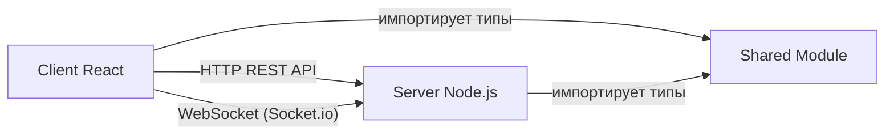
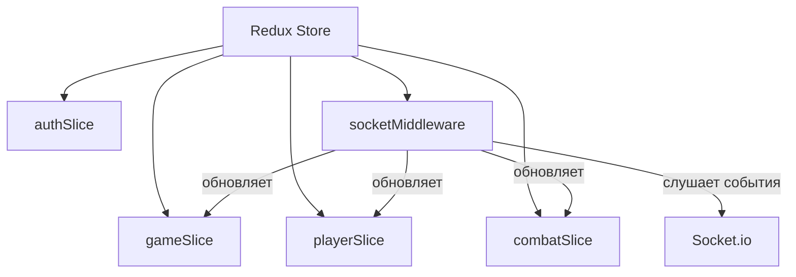
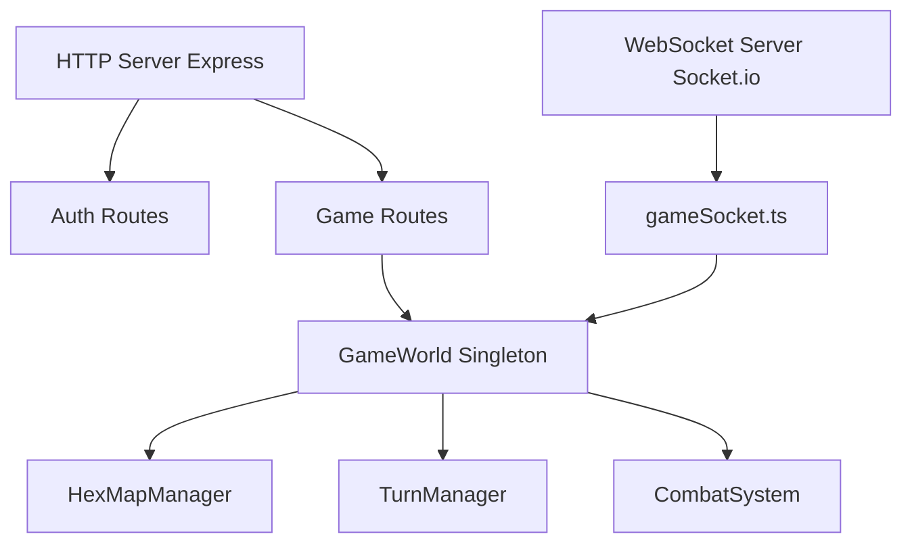
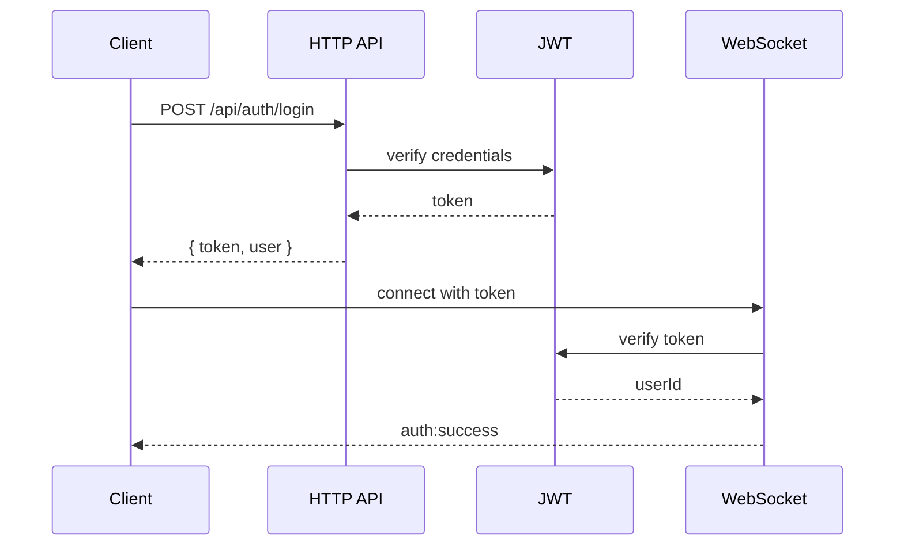
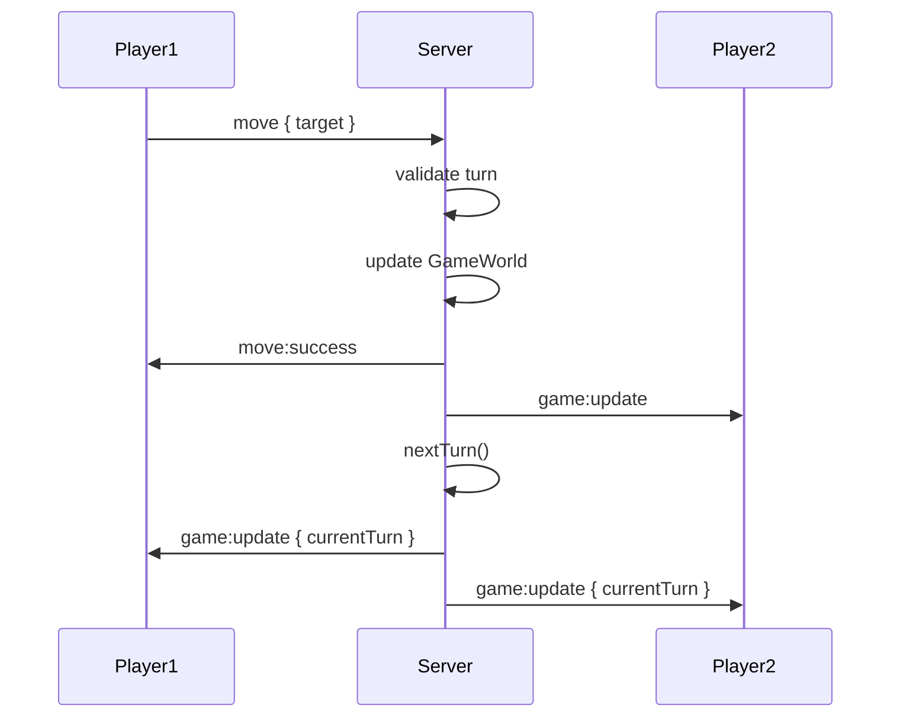

# Архитектура Hexploration

## Обзор

Hexploration - это браузерная космическая MMORPG с пошаговой механикой и гексагональной картой. Проект построен по принципу монорепозитория с тремя основными модулями.

## Структура проекта

### Монорепозиторий (npm workspaces)

```
hexploration/
├── client/    - React клиент
├── server/    - Node.js сервер  
├── shared/    - Общие типы и утилиты
└── package.json
```

### Коммуникация между модулями



## Клиент (client/)

### Стек технологий
- **React 18** - UI библиотека
- **TypeScript** - статическая типизация
- **Redux Toolkit** - управление состоянием
- **Vite** - сборщик и dev-сервер
- **Canvas API** - рендеринг игры
- **Socket.io-client** - WebSocket клиент

### Redux Store



### Структура компонентов

```
src/
├── components/
│   ├── game/
│   │   └── HexGrid.tsx          # Canvas рендеринг гексов
│   └── ui/
│       ├── GameHUD.tsx          # Верхняя панель HUD
│       └── PlayerList.tsx       # Список игроков
├── pages/
│   ├── LoginPage.tsx            # Страница входа
│   └── GamePage.tsx             # Главная игра
├── store/
│   ├── store.ts                 # Конфигурация Redux
│   ├── hooks.ts                 # Типизированные хуки
│   ├── slices/                  # Redux slices
│   └── middleware/
│       └── socketMiddleware.ts  # Socket.io integration
└── services/
    ├── apiService.ts            # HTTP API клиент
    └── socketService.ts         # Socket.io wrapper
```

### Рендеринг гексагональной карты

HexGrid компонент использует Canvas API для отрисовки:

1. **Координатная система**: Axial coordinates (q, r)
2. **Преобразования**: hexToPixel() и pixelToHex()
3. **Рендеринг**:
   - Гексы с разными цветами по типам
   - Корабли игроков (круги с именами)
   - Подсветка наведения
4. **Интерактивность**:
   - onClick - перемещение
   - onMouseMove - подсветка гекса

## Сервер (server/)

### Стек технологий
- **Node.js** + **TypeScript**
- **Express** - HTTP сервер
- **Socket.io** - WebSocket сервер
- **JWT** - аутентификация
- **bcrypt** - хеширование паролей

### Архитектура сервера



### Игровая логика

#### GameWorld (singleton)
- Центральный менеджер игрового состояния
- Хранит всех игроков и карту
- Координирует между модулями

#### HexMapManager
- Генерация гексагональной карты
- Управление типами секторов
- Отслеживание занятости гексов

#### TurnManager (EventEmitter)
- Управление очередью ходов
- События: turn:changed, round:complete
- Автоматическая смена ходов

#### CombatSystem
- Боевая физика (в разработке)
- Управление снарядами
- Проверка столкновений

### Socket.io события

#### Клиент → Сервер
- `auth` - аутентификация с токеном
- `move` - перемещение на гекс
- `combat:action` - боевое действие

#### Сервер → Клиент
- `auth:success` - успешная аутентификация
- `game:state` - полное состояние игры
- `game:update` - инкрементальное обновление
- `player:join` / `player:leave` - игроки
- `combat:start` / `combat:update` / `combat:end` - бой

## Shared модуль (shared/)

### Назначение
Общие типы TypeScript и утилиты для клиента и сервера.

### Содержимое

#### Типы
- `hex.types.ts` - HexCoordinates, HexCell, HexType
- `player.types.ts` - Player, Ship, Weapon
- `game.types.ts` - GameState, CombatState, SocketEvent

#### Утилиты
- `hexUtils.ts` - работа с гексагональными координатами:
  - axialToCube / cubeToAxial
  - hexDistance
  - hexNeighbors
  - hexToPixel / pixelToHex
  - hexRound

#### Константы
- `game.constants.ts`:
  - MAP_RADIUS = 10
  - HEX_SIZE = 50
  - SHIP_STATS (характеристики кораблей)
  - WEAPON_STATS (характеристики оружия)

## Поток данных

### Аутентификация



### Игровой цикл



## Гексагональная система координат

### Axial координаты
Используем систему (q, r):
- q - колонка (ось X)
- r - ряд (ось диагональная)

### Преобразования
- **Axial → Cube**: (q, r) → (x, y, z) где x=q, z=r, y=-x-z
- **Расстояние**: max(|x|, |y|, |z|) в cube координатах
- **Соседи**: 6 направлений от любого гекса

### Визуализация (flat-top)
```
x = size * (3/2 * q)
y = size * (√3/2 * q + √3 * r)
```

## Масштабирование

### Текущая реализация (MVP)
- In-memory хранилище
- Одна игровая комната
- Синхронные операции

### Будущие улучшения
1. **База данных**
   - PostgreSQL для персистентности
   - Redis для кэша и сессий

2. **Множественные комнаты**
   - Socket.io rooms
   - Изолированные GameWorld инстансы

3. **Горизонтальное масштабирование**
   - Redis adapter для Socket.io
   - Разделение игровых миров

## Безопасность

### Аутентификация
- JWT токены (7 дней expiry)
- bcrypt для хеширования паролей (rounds=10)
- Middleware проверка токенов в Socket.io

### Валидация
- Проверка длины username/password
- Проверка владельца хода перед движением
- Проверка расстояния перемещения
- Проверка существования целевого гекса

## Performance

### Клиент
- Canvas рендеринг (hardware accelerated)
- Redux мемоизация селекторов
- React.memo для компонентов

### Сервер
- Event-driven архитектура
- Инкрементальные обновления (не полное состояние)
- Debouncing для частых событий

## Тестирование

### Юнит-тесты (TODO)
- hexUtils.ts функции
- Redux reducers
- Игровая логика (TurnManager, HexMap)

### Интеграционные тесты (TODO)
- Socket.io события
- API endpoints
- Полный игровой цикл

### E2E тесты (TODO)
- Playwright для браузерных тестов
- Симуляция мультиплеера
